# Gen-AI-Basics

# 🧠 Gen AI Basics

## 📑 Table of Contents
 
- [What is an LLM?](#-what-is-an-llm)
- [Model vs LLM](#-model-vs-llm)
- [Popular LLMs](#-popular-llms)
- [Using LLMs via SDKs](#-using-llms-via-sdks)
- [The Multi-SDK Problem](#-the-problem)
- [LangChain — The Solution](#-langchain--the-solution)
- [LangChain Core Components](#-langchain-core-components)
  - [1. Models](#1️⃣-models)
  - [2. Prompts](#2️⃣-prompts)
  - [3. Chains](#3️⃣-chains)
  - [4. Memory](#4️⃣-memory)
  - [5. Indexes](#5️⃣-indexes)
  - [6. Agents](#6️⃣-agents)
- [Quick Revision Checklist](#-quick-revision-checklist)
---
 
## ❓ What is an LLM?
 
> **LLM = Large Language Model**
 
Break the term into 3 words:
 
| Word | Meaning |
|---|---|
| **Large** | Trained on a *huge* amount of text data (books, websites, Wikipedia, articles, code, conversations, etc.) |
| **Language** | Understands & generates human language — English, Hindi, Spanish... even programming languages like Python |
| **Model** | A deep learning system (a neural network) that learns patterns from data |
 
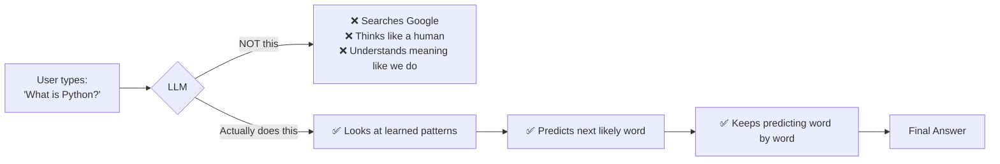
 
> 💡 **Analogy:** It's like your phone's keyboard autocomplete — but supercharged with billions of parameters and trained on massive datasets.
 
---
 
## 🧠 Model vs LLM
 
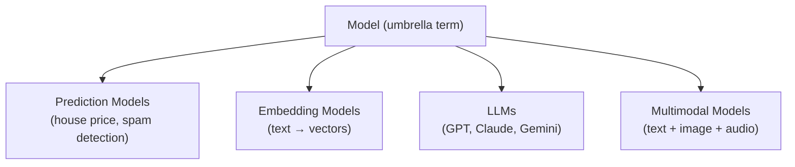
 
- **Model** = any trained AI system that learns patterns from data.
- **LLM** = a *specific type* of model that specializes in understanding and generating **language**.
- Every LLM is a model, but not every model is an LLM (e.g. an embedding model isn't an LLM).
---
 
## ⭐ Popular LLMs
 
| Model Family | Provider |
|---|---|
| GPT Models | OpenAI |
| Gemini Models | Google DeepMind |
| LLaMA | Meta |
| Claude | Anthropic |
| Grok | xAI |
| Mistral | Mistral AI |
 
> 📌 In Generative AI, we **don't build these models from scratch** — we learn how to use these **pre-built LLMs** effectively.
 
---
 
## 💻 Using LLMs via SDKs
 
<details>
<summary><b>OpenAI</b></summary>
```python
from openai import OpenAI
 
client = OpenAI()
 
response = client.chat.completions.create(
    model="gpt-4o-mini",
    messages=[
        {"role": "system", "content": "You are a helpful assistant."},
        {"role": "user", "content": "Explain what is a Large Language Model in simple terms."}
    ],
)
 
print(response.choices[0].message.content)
```
</details>
<details>
<summary><b>Gemini</b></summary>
```python
import google.generativeai as genai
import os
 
genai.configure(api_key=os.environ["GOOGLE_API_KEY"])
 
model = genai.GenerativeModel("gemini-1.5-flash")
 
response = model.generate_content(
    "Explain what is a Large Language Model in simple terms."
)
 
print(response.text)
```
</details>
<details>
<summary><b>Claude</b></summary>
```python
import anthropic
import os
 
client = anthropic.Anthropic(
    api_key=os.environ["ANTHROPIC_API_KEY"]
)
 
response = client.messages.create(
    model="claude-3-5-sonnet-latest",
    max_tokens=300,
    messages=[
        {"role": "user", "content": "Explain what is a Large Language Model in simple terms."}
    ],
)
 
print(response.content[0].text)
```
</details>
---
 
## ⚠️ The Problem
 
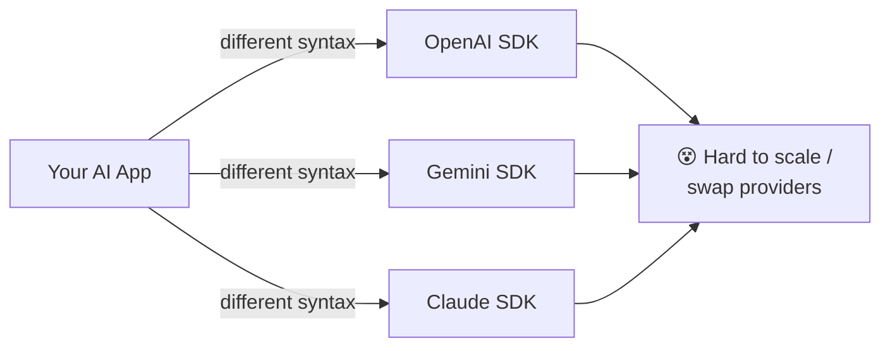
 
If every provider has a **different SDK**, **different syntax**, and a **different response format** — how do we build scalable AI applications?
 
---
 
## 🔗 LangChain — The Solution
 
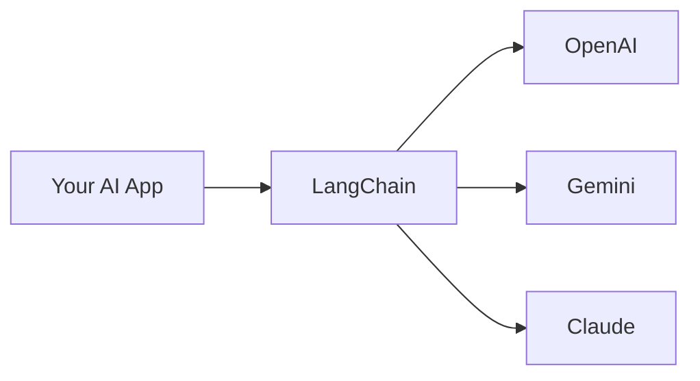
 
**LangChain** is a framework that standardizes how you talk to different LLM providers — write your logic once, swap models/providers without rewriting everything.
 
---
 
## 🧩 LangChain Core Components
 
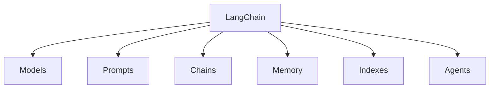
 
### 1️⃣ Models
 
The **core intelligence layer** — connects your app to LLM providers (OpenAI, Google DeepMind, Anthropic).
 
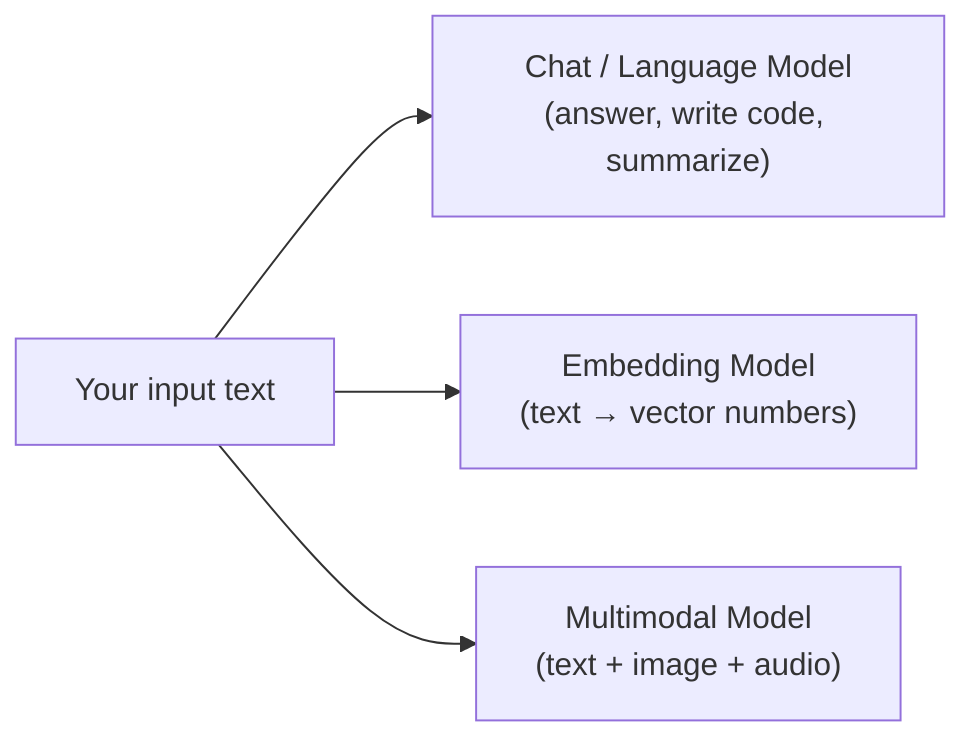
 
| Type | What it does |
|---|---|
| **Chat / Language Models** | Generate text, answer questions, write code, summarize content |
| **Embedding Models** | Convert text → numbers (vectors); used in search & RAG |
| **Multimodal Models** | Work with more than text — images, audio, files |
 
---
 
### 2️⃣ Prompts
 
A **prompt** is the instruction given to an LLM — it tells the model *what to do*, *how to respond*, and *what format to use*.
 
> 📌 Better prompt → Better output. LLMs aren't mind readers.
 
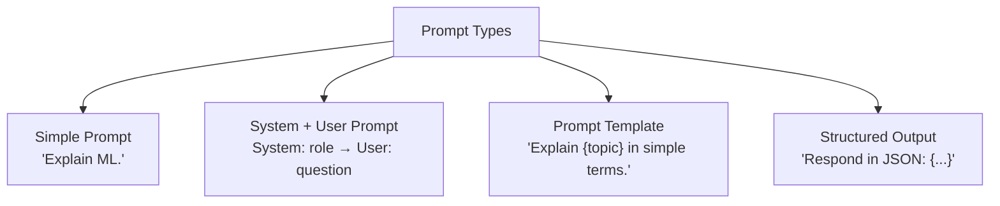
 
<details>
<summary><b>Examples for each type</b></summary>
**Simple Prompt**
```
Explain what is Machine Learning.
```
 
**System + User Prompt**
```
System: You are a helpful AI teacher.
User: Explain LLMs in simple terms.
```
 
**Prompt Template**
```
Explain {topic} in simple terms.
```
 
**Structured Output**
```
Respond in JSON format with keys: definition, example.
```
</details>
---
 
### 3️⃣ Chains
 
A **Chain** is a sequence of connected steps.
 
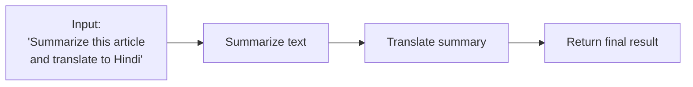
 
Instead of `One Prompt → One Response`, a chain does `Step 1 → Step 2 → Step 3 → Final Output`. Real AI applications are rarely single-step.
 
---
 
### 4️⃣ Memory
 
Allows the AI system to **remember past interactions**.
 
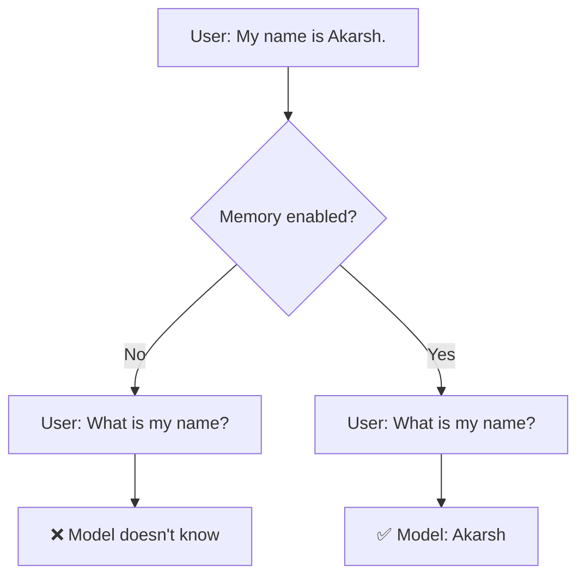
 
---
 
### 5️⃣ Indexes
 
LLMs only know what they were trained on. **Indexes** connect external data to an LLM.
 
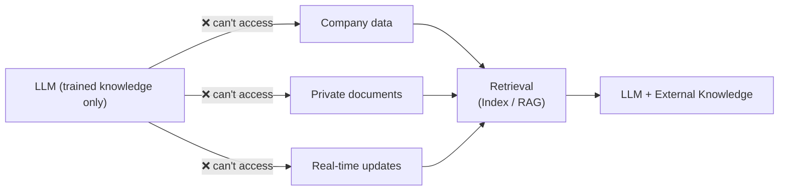
 
**Why needed?** LLMs don't know your company data, private documents, or real-time info.
**Solution:** Connect external knowledge → this system is called **Retrieval** (the "R" in **RAG**).
 
---
 
### 6️⃣ Agents
 
AI systems that **decide what action to take** — dynamically.
 
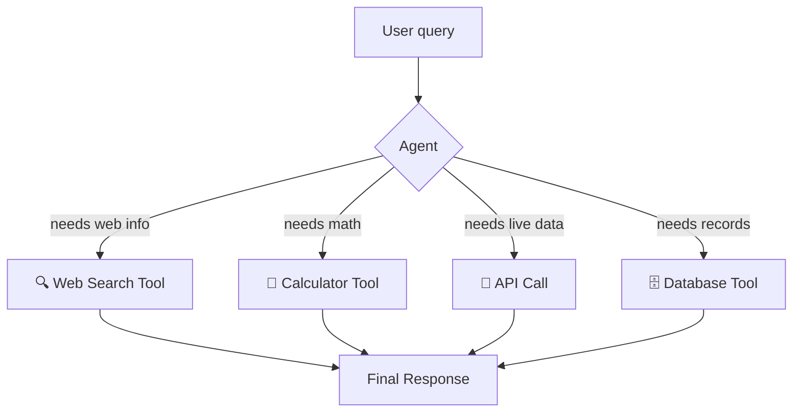
 
| Chains | Agents |
|---|---|
| Follow **fixed** steps | **Decide** the next step dynamically |
 
A normal LLM flow is `User → Prompt → Response`. But if a task needs web search, calculations, API calls, or a database — the LLM alone can't do that. It needs **tools**, and an **Agent** decides which tool to use and when.
 
---
 
## 📝 Quick Revision Checklist
 
- [ ] Can explain LLM in 3 words (Large, Language, Model)
- [ ] Can explain Model vs LLM difference
- [ ] Can name 4+ popular LLMs and their providers
- [ ] Understand why raw provider SDKs don't scale
- [ ] Can explain all 6 LangChain components in one line each
- [ ] Know all 4 types of prompts with an example each
- [ ] Understand Chains vs Agents (fixed steps vs dynamic decisions)
- [ ] Understand Memory (context retention) with an example
- [ ] Understand Indexes/Retrieval and how it connects to RAG
 
